# Information of the group

1. Link github: [https://github.com/Quanhcmus/Lab1_data_mining](https://github.com/Quanhcmus/Lab1_data_mining)
2. Group member information
   |ID|FULL NAME|EMAIL|
   |--|---------|-----|
   |20120554|Nguyễn Minh Quân|20120554@student.hcmus.edu.vn|
   |20120587|Nguyễn Hoàng Thịnh|20120587@student.hcmus.edu.vn|
3. The contribution rate of each member
   - 20120554:
      + 3.1: Install WEKA ( Requirement 1) (100%)
      + 3.2.1: Exploring Breast Cancer data set (100%)
      + 3.2.2: Exploring Weather data set (100%)
      + 3.3.5: Deleting columns containing more than a particular number of missing values (0%)
      + 3.3.6: Delete duplicate samples. (0%)
      + 3.3.7: Normalize a numeric attribute using min-max and Z-score methods. (0%)
      + 3.3.8: Performing addition, subtraction, multiplication, and division between two numerical attributes (0%)
   - 20120587: 
      + 3.1 : Install WEKA ( Requirement 1+2) (0%)
      + 3.2.3: Exploring Credit in Germany data set (0%)
      + 3.3.1: Extract columns with missing values (0%)
      + 3.3.2: Count the number of lines with missing data (0%)
      + 3.3.3: Fill in the missing value using mean, median (for numeric properties) and mode (for the categorical attribute). (0%)
      + 3.3.4: Deleting rows containing more than a particular number of missing values (0%)
  
   **Total task completed:** 100%

# Preprocessing and data mining

## Install WEKA (0.5 points)

### Requirement 1:
  - 20120554 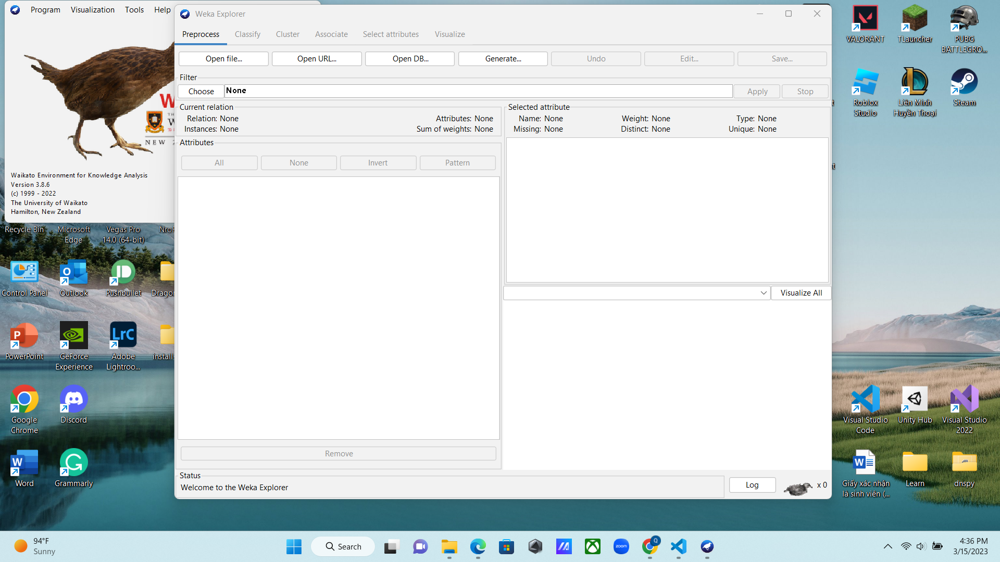
  - 20120587 

### Requirement 2:
  - **Current Relation**: abcd
  - **Attributes**: abcd
  - **Selected Attributes**: abcd
  - **Preprocess**: abcd
  - **More**: abcd 

## Getting Acquainted with WEKA (4.5 points)

### Exploring Breast Cancer data set
  - Load the data file **breast cancer.arf** 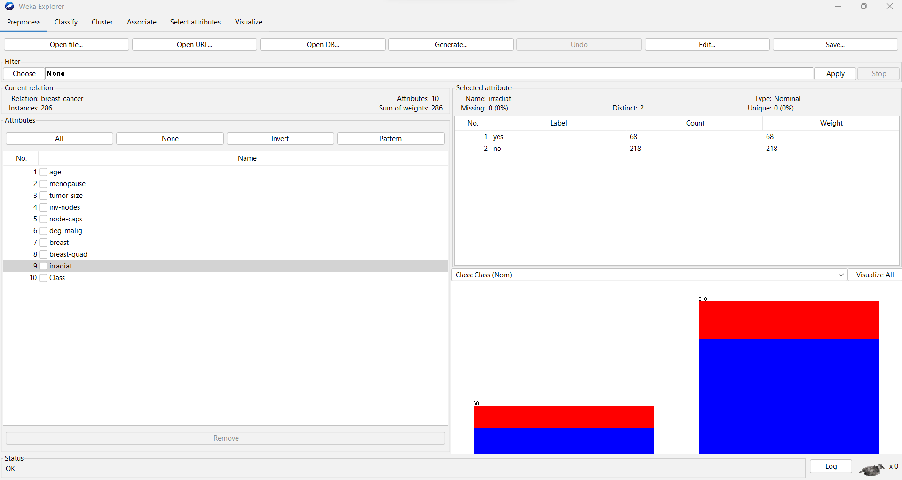
  - **How many instances does this data set have?**
  There are 286 instances in this dataset
  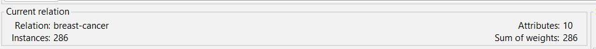
  - **How many attributes does this data set have?**
  There are 10 attributes in this dataset
  
  - **Which attribute is used for the label? Can it be changed? How?**
  *Class* is attributes used for the label, we can change by following these step:
     + Click *edit* button
        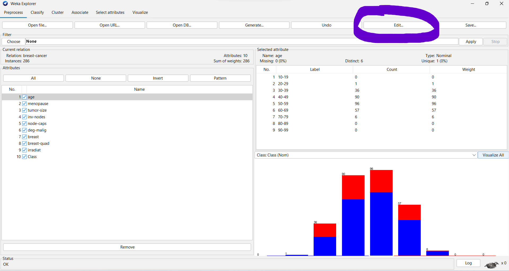
     + Choose the label *class*
        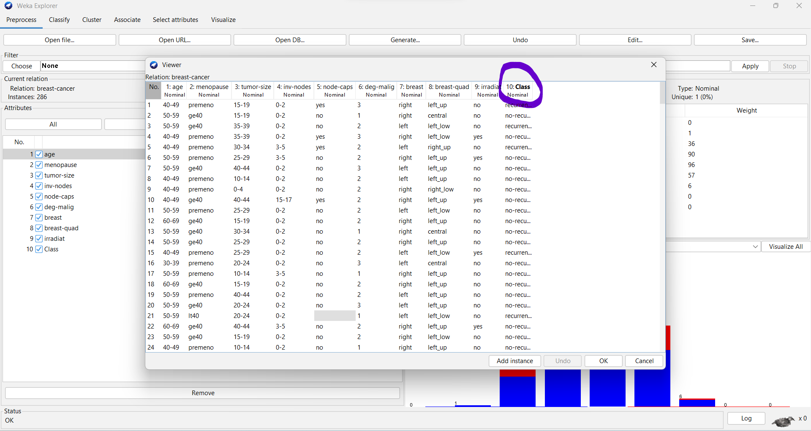
     + Select the cell which you want change
        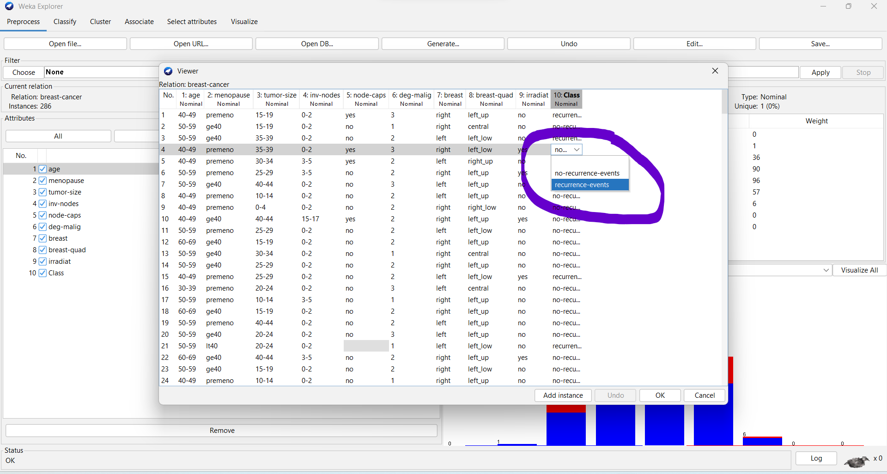
  - **What is the meaning of each attribute?**
     + **Age**: Patient's age include (10-19, 20-29, 30-39, 40-49, 50-59, 60-69, 70-79, 80-89, 90-99.)
     + **Menopause**: when your periods stop due to lower hormone levels. (lt40, ge40, premeno.)
     + **Tumor-size**: often measured in centimeters (cm) or inches. (0-4, 5-9, 10-14, 15-19, 20-24, 25-29, 30-34, 35-39, 40-44, 45-49, 50-54, 55-59.)
     + **Inv-nodes**: the number (range 0 - 39) of axillary lymph nodes that contain metastatic breast cancer visible on histological examination. (02,3-5, 6-8, 9-11, 12-14, 15-17, 18-20, 21-23, 24-26, 27-29, 30-32, 33-35, 36-39.)
     + **Node-caps**: if the cancer does metastasise to a. lymph node, although outside the original site of. the tumor it may remain “contained” by the cap- sule of the lymph node. (yes, no.)
     + **Deg-malig**:  the degree of malignancy of the tumor, which is also known as the tumor grade. (1, 2, 3.)
     + **Breast**: the breast location where the tumor was found. (left, right.)
     + **Breast.quad**: the quadrant of the breast where the tumor was found. (left-up, left-low, right-up, right-low, central.)
     + **Irradiat**: whether or not the patient received radiation therapy as part of their treatment for breast cancer. (yes, no.)
     + **Class**: indicates whether or not a patient experienced a recurrence of breast cancer after their initial treatment. (yes, no.)
  - **Let’s investigate the missing value status in each attribute and describe in general ways to solve the problem of missing values.**
     + **Node-caps**: 8 missing values
        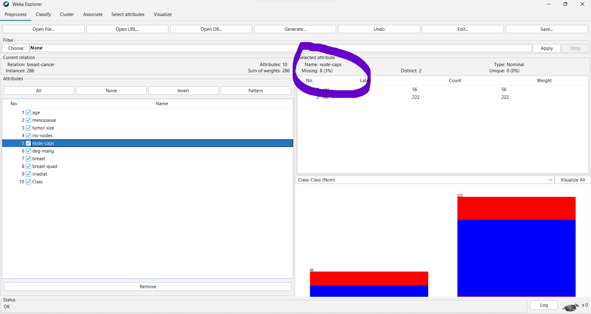
     + **Breast.quad**: 1 missing values
        
     + we can handle missing values by replaced with the property's mean
  - **Let’s propose solutions to the problem of missing values in the specific attribute.**
     + In **Node-caps** attributes we can replace with the most likely value infer from a Bayesian formula, decision tree or EM algorithm
     + In **Breast.quad** attributes we can replace with the property's mean
  - **Let’s explain the meaning of the chart in the WEKA Explorer. Setting the title for it and describing its legend.**
     + 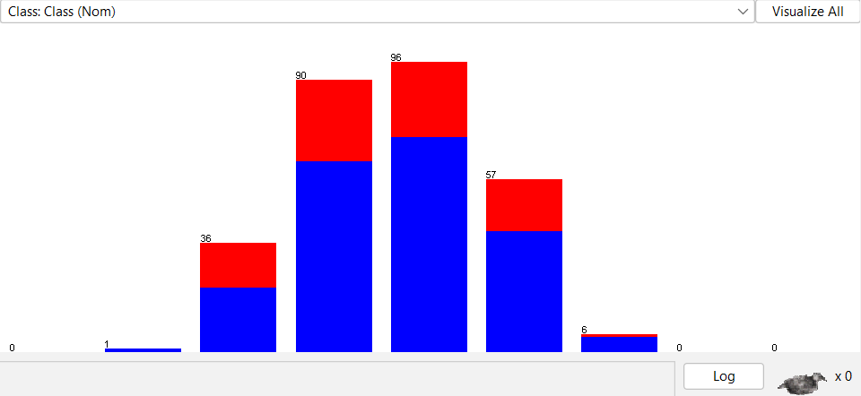
     + We can setting title chart is stacked bar chart
     + Red represents the patients recurrence-events
     + Blue represents the patients no-recurrence-events

### Exploring Weather data set
   - Load the data file **weather.numeric.arf** 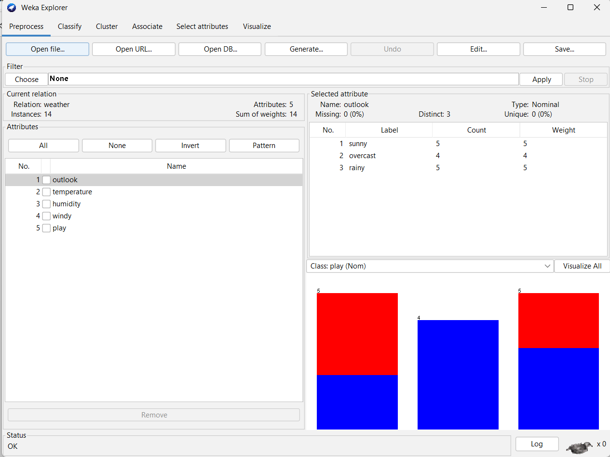
   - **How many attributes does this data set have? How many samples? Which attributes have data type categorical? Which attributes have a data type that is numerical? Which attribute is used for the label?**
      + There are **5** attributes, **14** samples in this data set 
      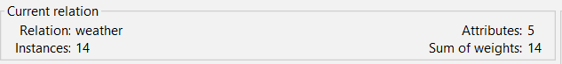
      + Attributes have data type categorical is **outlook**, **windy** and **play**
      + Attributes have data type numerical is **temperature** and **humudity**
      + Attributes used for the label is **play**
      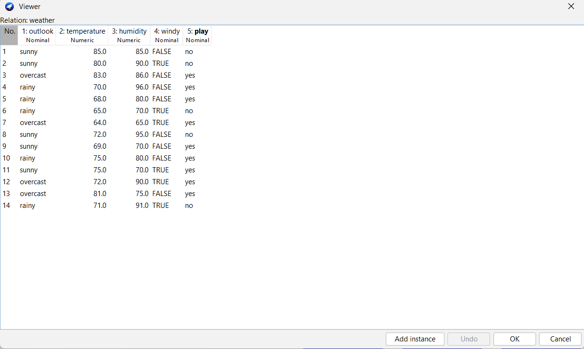
   - **Let’s list **five-number summary** of two attributes *temperature* and *humidity*. Does WEKA provide these values?**
      | | Min | Q1 | Median | Q3 | Max |
      |-|-----|----|--------|----|-----|
      |temperature| 64 | 69.25 | 72 | 78.75 | 85 |
      |humidity| 65 | 71.25 | 82.5 | 90 | 96 |
      + WEKA don't provide these values
   - **Let’s explain the meaning of all charts in the WEKA Explorer. Setting the title for it and describing its legend.**
      + All chart
      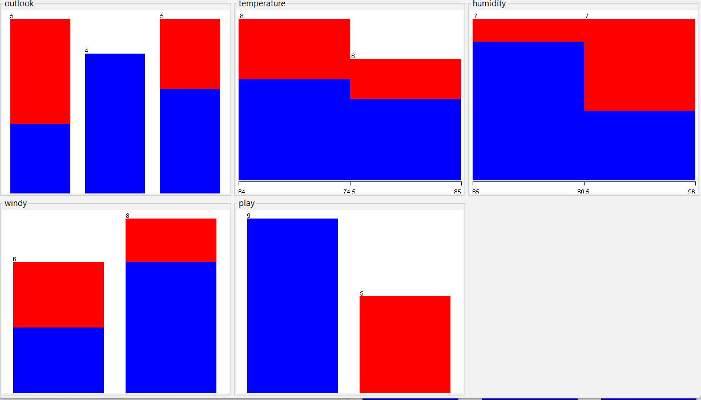
      + The graph shows the data distribution of the attributeThe graph shows the data distribution of the attribute
      + The title for it could be "Distribution chart"
      + Blue is no
      + Red is yes
   - **Let’s move to the Visualize tag. What’s the name of this chart? Do you think there are any pairs of different attributes that have correlated?**
      + Chart in Visualize tag
      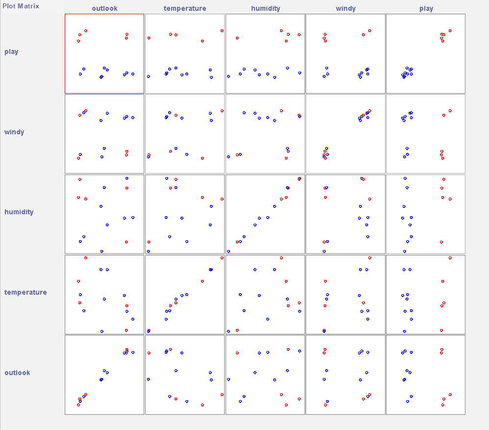
      + The name of this chart is scatter plot of attributes
      + We think humidity and play are correlated

### Exploring Credit in Germany data set

## Preprocessing Data in Python (5 points)
