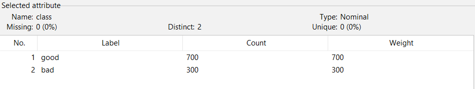
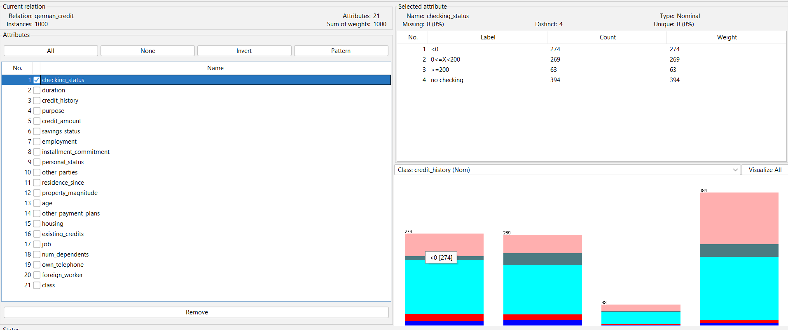
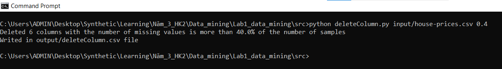
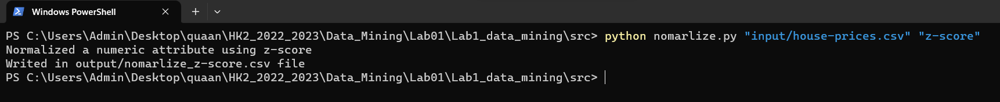

# Information of the group

1. Link github: [https://github.com/Quanhcmus/Lab1_data_mining](https://github.com/Quanhcmus/Lab1_data_mining)
2. Group member information
   |ID|FULL NAME|EMAIL|
   |--|---------|-----|
   |20120554|Nguyễn Minh Quân|20120554@student.hcmus.edu.vn|
   |20120587|Nguyễn Hoàng Thịnh|20120587@student.hcmus.edu.vn|
3. The contribution rate of each member
   - 20120554:
      + 3.1: Install WEKA ( Requirement 1) (100%)
      + 3.2.1: Exploring Breast Cancer data set (100%)
      + 3.2.2: Exploring Weather data set (100%)
      + 3.3.5: Deleting columns containing more than a particular number of missing values (100%)
      + 3.3.6: Delete duplicate samples. (100%)
      + 3.3.7: Normalize a numeric attribute using min-max and Z-score methods. (100%)
      + 3.3.8: Performing addition, subtraction, multiplication, and division between two numerical attributes (100%)
   - 20120587: 
      + 3.1 : Install WEKA ( Requirement 1+2) (100%)
      + 3.2.3: Exploring Credit in Germany data set (0%)
      + 3.3.1: Extract columns with missing values (0%)
      + 3.3.2: Count the number of lines with missing data (0%)
      + 3.3.3: Fill in the missing value using mean, median (for numeric properties) and mode (for the categorical attribute). (0%)
      + 3.3.4: Deleting rows containing more than a particular number of missing values (0%)
  
   **Total task completed:** 100%

# Preprocessing and data mining

## Install WEKA (0.5 points)

### Requirement 1: Capturing a screen.
  - 20120554 
  - 20120587 

### Requirement 2: Explaining the meaning.
- **Preprocess** tag:
  - Current Relation: 
      - Relation: Refers to the name of the current dataset being processed.
      - Attributes: The number of attributes.
      - Instances: The number of rows.
      - Sum of weights: The total weight of instances.
  - Attributes: Specify a subset of attributes that should be used for subsequent processing.
      - All: Selects all attributes.
      - None: Unselects all attributes.
      - Invert: Inverts the current attribute selection.
      - Pattern: Selects all attributes that match a reg. expression.
  - Selected Attributes: Specify a single attribute that should be used for subsequent processing and have some information like Name, Type, Missing, Distinct, Unique.
- **Classify** tag: Uses machine learning algorithm to predict the class label of a data instance based on its input attributes.
- **Cluster** tag: Uses machine learning algorithm to group data instances into clusters based on their similarity.
- **Associate** tag: Uses machine learning algorithm to discover association rules from data.
- **Select attributes** tag: Specify the set of attributes to be used for a particular task, such as classification or clustering. This tag is typically used in conjunction with other tags, such as the Classifier or Cluster tags.
- **Visualize** tag: Specify a visualization method for the results of an analysis and help users understand the patterns and relationships in the data

## Getting Acquainted with WEKA (4.5 points)

### Exploring Breast Cancer data set
  - Load the data file **breast cancer.arff** 
  - **How many instances does this data set have?**
  There are 286 instances in this dataset
  
  - **How many attributes does this data set have?**
  There are 10 attributes in this dataset
  
  - **Which attribute is used for the label? Can it be changed? How?**
  *Class* is attributes used for the label, we can change by following these step:
     + Click *edit* button
        
     + Choose the label *class*
        
     + Select the cell which you want change
        
  - **What is the meaning of each attribute?**
     + **Age**: Patient's age include (10-19, 20-29, 30-39, 40-49, 50-59, 60-69, 70-79, 80-89, 90-99.)
     + **Menopause**: when your periods stop due to lower hormone levels. (lt40, ge40, premeno.)
     + **Tumor-size**: often measured in centimeters (cm) or inches. (0-4, 5-9, 10-14, 15-19, 20-24, 25-29, 30-34, 35-39, 40-44, 45-49, 50-54, 55-59.)
     + **Inv-nodes**: the number (range 0 - 39) of axillary lymph nodes that contain metastatic breast cancer visible on histological examination. (02,3-5, 6-8, 9-11, 12-14, 15-17, 18-20, 21-23, 24-26, 27-29, 30-32, 33-35, 36-39.)
     + **Node-caps**: if the cancer does metastasise to a. lymph node, although outside the original site of. the tumor it may remain “contained” by the cap- sule of the lymph node. (yes, no.)
     + **Deg-malig**:  the degree of malignancy of the tumor, which is also known as the tumor grade. (1, 2, 3.)
     + **Breast**: the breast location where the tumor was found. (left, right.)
     + **Breast.quad**: the quadrant of the breast where the tumor was found. (left-up, left-low, right-up, right-low, central.)
     + **Irradiat**: whether or not the patient received radiation therapy as part of their treatment for breast cancer. (yes, no.)
     + **Class**: indicates whether or not a patient experienced a recurrence of breast cancer after their initial treatment. (yes, no.)
  - **Let’s investigate the missing value status in each attribute and describe in general ways to solve the problem of missing values.**
     + **Node-caps**: 8 missing values
        
     + **Breast.quad**: 1 missing values
        
     + we can handle missing values by replaced with the property's mean
  - **Let’s propose solutions to the problem of missing values in the specific attribute.**
     + In **Node-caps** attributes we can replace with the most likely value infer from a Bayesian formula, decision tree or EM algorithm
     + In **Breast.quad** attributes we can replace with the property's mean
  - **Let’s explain the meaning of the chart in the WEKA Explorer. Setting the title for it and describing its legend.**
     + 
     + We can setting title chart is stacked bar chart
     + Red represents the patients recurrence-events
     + Blue represents the patients no-recurrence-events

### Exploring Weather data set
   - Load the data file **weather.numeric.arff** 
   - **How many attributes does this data set have? How many samples? Which attributes have data type categorical? Which attributes have a data type that is numerical? Which attribute is used for the label?**
      + There are **5** attributes, **14** samples in this data set 
      
      + Attributes have data type categorical is **outlook**, **windy** and **play**
      + Attributes have data type numerical is **temperature** and **humudity**
      + Attributes used for the label is **play**
      
   - **Let’s list **five-number summary** of two attributes *temperature* and *humidity*. Does WEKA provide these values?**
      | | Min | Q1 | Median | Q3 | Max |
      |-|-----|----|--------|----|-----|
      |temperature| 64 | 69.25 | 72 | 78.75 | 85 |
      |humidity| 65 | 71.25 | 82.5 | 90 | 96 |
      + WEKA don't provide these values
   - **Let’s explain the meaning of all charts in the WEKA Explorer. Setting the title for it and describing its legend.**
      + All chart
      
      + The graph shows the data distribution of the attributeThe graph shows the data distribution of the attribute
      + The title for it could be "Distribution chart"
      + Blue is no
      + Red is yes
   - **Let’s move to the Visualize tag. What’s the name of this chart? Do you think there are any pairs of different attributes that have correlated?**
      + Chart in Visualize tag
      
      + The name of this chart is scatter plot of attributes
      + We think humidity and play are correlated

### Exploring Credit in Germany data set
   - Load the data file **credit-g.arf** 
   - **What is the content of the comments section in credit-g.arff (when opened with any text editor) about? How many samples does the data set have? How many attributes? Describe any fiveattributes (must have both discrete and continuous attributes).**
      + The content of the comments section (when opened with any text editor): Description of the German credit dataset. Included: Title, Source Information, Number of Instances,etc.
      
      + The data set have 1000 samples
      + The data set have 21 attributes
      
      + Describe any five attributes:
         + checking_status (Discrete attribute): Status of existing checking account. Missing: 0%, Distinct: 4, Type: Nominal, Unique: 0%.
          
         + duration (Continuous attribute): Duration in month. Missing: 0%, Distinct: 33, Type: Numeric, Unique: 5(1%).
         
         + credit_history (Discrete attribute): Credit history. Missing: 0%, Distinct: 5, Type: Nominal, Unique: 0%.
         
         + purpose (Discrete attribute): Purpose.
Missing: 0%, Distince: 10, Type: Nominal, Unique: 0%.
         
         + credit_amount (Continuous attribute): Credit amount.
Missing: 0%, Distinct: 921, Type: Numeric, Unique: 847(85%).
         
   - **Which attribute is used for the label?**
     **=>class** is used for the label.
      
   - **Let’s describe the distribution of continuous attributes? (Left skewed or right skewed ?)**
     **=>** Contrinous attributes: **duration**, **credit_amount**, **installment_commitment**, **residence_since**, **age**, **existing_credits**, **num_dependents**.
      + **duration**: Right skewed.
       
      + **credit_amount**: Right skewed.
      
      + **installment_commitment**: Right skewed.
      
      + **residence_since**: Right skewed.
      
      + **age**: Right skewed.
      
      + **existing_credits**: Right skewed.
      
      + **num_dependents**: Right skewed.
      
   - **Let’s explain the meaning of all charts in the WEKA Explorer. Setting the title for it and describing its legend.**
   **=>** Having 4 charts in the WEKA Explorer: 
      - The first chart: 
      
         - Explaining: It shows the bar chart with different colors correspond to each label at nominal attributes.
         - Setting the title for it: Own chart of nominal attribute.
         - Describing its legend: Each color corresponds to each label of nominal attribute.
      - The second chart: 
      
         - Explaining: It shows the bar chart with one color (Black) about the relationship from nominal attribute (no attribute) to numeric attribute and because the numeric attribute don't have label so it is only one color.
         - Setting the title for it: Chart from nominal(no class) to numeric. 
         - Describing its legend: Black shows value of numeric attribute.
      - The third chart: 
      
         - Explaining: It shows the stacked bar chart about the relationship from nominal attribute to different nominal attribute.
         - Setting the title for it: Chart from nominal to nominal.
         - Describing its legend: Each color corresponds to labels of the nominal attribute be chosen in "Attributes" (On the left)
      - The fourth chart: 
      
        - Explaining: It shows the bar chart having only the range of value in numeric attribute.
        - Setting the title for it: Chart for numeric
        - Describing its legend: Don't have legend.
   - **Let’s move to the Select attributes tag. Describe all of the options for attribute selection.**
     **=>** Having 11 options for Attribute Evaluator and 3 options for Search Method.
      - Attribute Evaluator:
         - **CfsSubsetEval**: Evaluates the worth of a subset of attributes by considering the individual predictive ability of each feature along with the degree of redundancy between them.
         - **ClassifierAttributeEval**: Evaluates the worth of an attribute by using a user-specified classifier.
         - **ClassifierSubsetEval**: Evaluates attribute subsets on training data or a separate hold out testing set.
         - **CorrelationAttributeEval**: Evaluates the worth of an attribute by measuring the correlation (Pearson's) between it and the class.
         - **GainRadioAttributeEval**: Evaluates the worth of an attribute by measuring the gain ratio with respect to the class.
         - **InfoGainAttributeEval**: Evaluates the worth of an attribute by measuring the information gain with respect to the class.
         - **OneRAttributeEval**: Evaluates the worth of an attribute by using the OneR classifier.
         - **PrincipalComponents**: Performs a principal components analysis and transformation of the data.
         - **ReliefFAttributeEval**: Evaluates the worth of an attribute by repeatedly sampling an instance and considering the value of the given attribute for the nearest instance of the same and different class.
         - **SymmetricalUncertAttributeEval**: Evaluates the worth of an attribute by measuring the symmetrical uncertainty with respect to the class.
         - **WrapperSubsetEval**: Evaluates attribute sets by using a learning scheme.
      - Search Method:
         - **BestFirst**: Searches the space of attribute subsets by greedy hillclimbing augmented with a backtracking facility.
         - **GreedyStepwise**: Performs a greedy forward or backward search through the space of attribute subsets.
         - **Ranker**: Ranks attributes by their individual evaluations.
   - **Which options should be used to select the 5 attributes with the highest correlation?(Step-by-step description, with step-by-step photos and final results)** **=>** The options should be used are **CorrelationAttributeEval**, **InfoGainAttributeEval**, **ReliefFAttributeEval** or **PrincipalComponents**, etc. 
    - For example with **CorrelationAttributeEval**: 
      - Step 1: Click on the "Choose" button in "Attribute Evalutor" and click on "CorrelationAttributeEval".
      
      - Step 2: Click on the "Ranker" in "Search Method" (Ranker is defaulted to choose when choosing "CorrelationAttributeEval")
      and set numToSelect to 5, after that click on the "OK" button.
      
      - Step 3: Click on the "Start" button to run the filter. The output will display the 5 attributes with the highest correlation. (Note: Choose the right list in result lists)
      
      - The final result: 
      

## Preprocessing Data in Python (5 points)
The program must have the following functions (0.5 points for each function):
### Extract columns with missing values

### Count the number of lines with missing data.

### Fill in the missing value using mean, median (for numeric properties) and mode (for the categorical attribute).

### Deleting rows containing more than a particular number of missing values (Example: delete rows with the number of missing values is more than 50% of the number of attributes).

### Deleting columns containing more than a particular number of missing values (Example: delete columns with the number of missing values is more than 50% of the number of samples).
   + Run file **deleteColumn.py**: 

###  Delete duplicate samples.
   + Run file **deleteDuplicate.py**: 

### Normalize a numeric attribute using min-max and Z-score methods
   + Run file **nomarlize.py** with min-max score: 
   + Run file **nomarlize.py** with z-score: 

### Performing addition, subtraction, multiplication, and division between two numerical attributes
   + Run file **calculation** with add column 3 and 4: 
   + Run file **calculation** with sub column 3 and 4: 
   + Run file **calculation** with mul column 3 and 4: 
   + Run file **calculation** with div column 3 and 4: 
